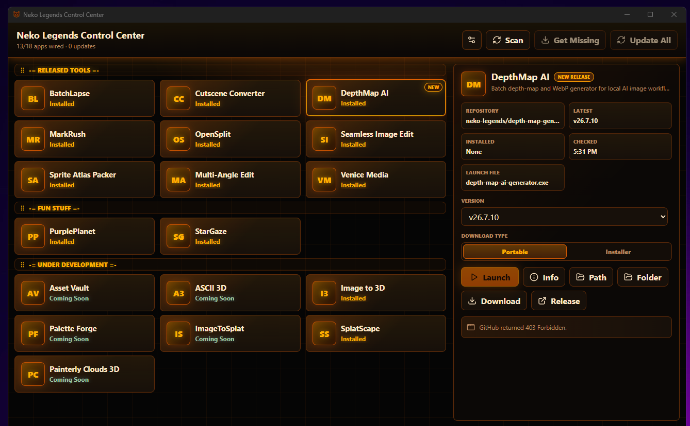

# Neko Legends Control Center

Neko Legends Control Center is a portable Windows launcher and update hub for a growing collection of free Neko Legends / ForPublic tools.

The bigger goal is game development. I am building these tools while I build games, because making games is already hard enough without rebuilding the same helper utilities over and over. This collection is meant to give people useful open source tools for graphics, video, audio, workflow automation, and game starter projects so they can spend more time making games and less time making the tools around the game.

The tools are for humans building manually, humans working with AI agents, and AI agents that need automation-friendly utilities they can launch, inspect, modify, or extend. If we share the boring-but-necessary tools, everyone can move faster.

[](screenshot.png)

_Click the screenshot to view it at full size._

## What People Can Do With It

- Launch local Neko Legends tools from one compact desktop window.
- Scan GitHub releases and see which apps are installed, missing, coming soon, or ready to update.
- Download portable or installer builds per app. Portable is the default so launch usually works immediately.
- Pick or repair an app's launch path when a local executable needs to be selected manually.
- Open each app's GitHub README with the Info button.
- Open hosted demos for wallpaper art apps like StarGaze and PurplePlanet.
- Rearrange apps and categories with drag and drop.
- Switch themes, compact labels, and visible apps.
- Enable local AI Agent control for scripted status checks, downloads, updates, and launches.
- Discover the effective app/provider state through a credential-free capability provider catalog.
- Self-update the Control Center from the latest portable release when a newer version is available.

## Launching Apps

There are three ways to launch an installed app:

- Double-click the app tile.
- Right-click the app tile and choose Launch.
- Select the app, then click Launch in the details panel.

## Current Tools

Catalog snapshot: `catalog/tools.json` version 19, updated 2026-07-10.

### Released Tools

| App | Repository | Purpose |
| --- | --- | --- |
| BatchLapse | [neko-legends/BatchLapse](https://github.com/neko-legends/BatchLapse) | Batch video timelapse exporter for MP4, WebM, and GitHub-friendly GIFs. |
| Cutscene Converter | [neko-legends/CutsceneConverter](https://github.com/neko-legends/CutsceneConverter) | Prepare AI-generated videos for game engines with batch conversion, trimming, scaling, and combining. |
| DepthMap AI | [neko-legends/depth-map-generator](https://github.com/neko-legends/depth-map-generator) | Batch depth-map and WebP generator for local AI image workflows. |
| MarkRush | [neko-legends/MarkRush](https://github.com/neko-legends/MarkRush) | Fast local Markdown viewer/editor built for huge files and folders. |
| Multi-Angle Edit | [neko-legends/multi-angle-edit](https://github.com/neko-legends/multi-angle-edit) | Re-render an existing image from a new camera angle with Qwen-Image-Edit plus the Multiple-Angles LoRA. |
| OpenSplit | [neko-legends/OpenSplit](https://github.com/neko-legends/OpenSplit) | Multi-pane terminal harness for AI coding agents, shells, and SSH sessions. |
| Seamless Image Edit | [neko-legends/SeamlessImageEdit](https://github.com/neko-legends/SeamlessImageEdit) | Create seamless and tileable texture outputs from images or folders with seam repair, flattening, and 2x2 preview. |
| Sprite Atlas Packer | [neko-legends/sprite-atlas-packer](https://github.com/neko-legends/sprite-atlas-packer) | Turn loose sprite frames into deterministic TexturePacker-compatible PNG/WebP atlases. |
| Venice Media | [neko-legends/venice-media-local](https://github.com/neko-legends/venice-media-local) | Local Venice API media workspace for images, video, music, voice, and cleanup. |

### Hosted Demos And Fun Stuff

| App | Repository | Demo | Purpose |
| --- | --- | --- | --- |
| PurplePlanet | [neko-legends/PurplePlanet](https://github.com/neko-legends/PurplePlanet) | [Demo](https://nekolegends.com/res/projects/purplePlanet/) | Three.js planet motion art for live wallpapers and screensavers. |
| StarGaze | [neko-legends/StarGaze](https://github.com/neko-legends/StarGaze) | [Demo](https://nekolegends.com/res/projects/starGaze/) | Three.js starfield wallpaper and screensaver with tunable motion. |

### Under Development

These entries are visible in the Control Center, but downloads stay disabled until a public GitHub release is found. A manual Scan, or the startup stale-release scan, can promote an app automatically once it ships.

| App | Repository | Purpose |
| --- | --- | --- |
| Asset Vault | [neko-legends/AssetVault](https://github.com/neko-legends/AssetVault) | Local-first library for AI-generated game assets: import, triage, dedupe, search, export. |
| ASCII 3D | [neko-legends/ImageToASCII3D](https://github.com/neko-legends/ImageToASCII3D) | Image-to-ASCII converter with optional depth-map driven 3D parallax exports. |
| Image to 3D | [neko-legends/ImageTo3D](https://github.com/neko-legends/ImageTo3D) | Local image-to-3D workflow for mesh, texture, and 3D asset generation. |
| Palette Forge | [neko-legends/PaletteForge](https://github.com/neko-legends/PaletteForge) | Extract project palettes, remap assets, audit palette drift, and export engine-agnostic LUT/index textures. |
| ImageToSplat | [neko-legends/ImageToSplat](https://github.com/neko-legends/ImageToSplat) | Local TripoSplat workflow for turning a single image into Gaussian splat and point-cloud 3D exports. |
| SplatScape | [neko-legends/SplatScape](https://github.com/neko-legends/SplatScape) | Portable FPS-style explorer for 3D Gaussian splat scenes with WASD and mouse-look navigation. |
| Painterly Clouds 3D | [neko-legends/painterly-clouds-3d](https://github.com/neko-legends/painterly-clouds-3d) | Painterly Three.js cloud scene for stylized skyboxes, wallpapers, and motion art. |

## Dynamic Tool Catalog

The Control Center no longer needs a new app release every time a tool is added. It ships with a built-in fallback catalog, then tries to load the hosted catalog on startup:

```text
https://nekolegends.com/res/nekoLegendsControlCenter/tools.json
```

The repo copy lives at `catalog\tools.json`. Upload that file to the website path above when the public tool list changes.

Catalog behavior:

- If the hosted file loads, the app validates it, caches it locally, and uses it as the current tool list.
- If the hosted file is unavailable, the app uses the last cached catalog.
- If there is no cache yet, the app uses the built-in fallback list.
- The hosted file is metadata only. It can define tools, categories, colors, demo links, package preference, visibility, and status. It cannot define commands to run.
- The settings panel has a Remote catalog toggle. It is on by default. Turn it off to test the local `catalog\tools.json` before uploading it to the website.

Catalog status values:

- `available`: The tool can be shown as a normal tool. It still only becomes `Missing` after a GitHub release is known.
- `comingSoon`: The tool can be shown in the launcher, but downloads are disabled and stale release metadata is ignored.

Recommended catalog convention: put `comingSoon` tools in the `Under Development` category. If a scan finds a public release for an under-development app, the Control Center promotes it to `available` and moves it into the released tools group automatically. Reset Layout is only for restoring the default visual layout.

## Status Labels

- `Installed`: A local launch file or wallpaper package is present.
- `Missing`: A release exists, but the app has not been downloaded locally.
- `Coming Soon`: No public release is known yet.
- `Update Ready`: A newer release exists than the locally installed version.
- `Downloading`: A download is currently running.

## Portable Build

Run:

```powershell
npm run build:portable
```

The build script creates one portable app and one installer:

- `release\portable\neko-legends-control-center-portable.exe`
- `release\installer\Neko Legends Control Center_<version>_x64-setup.exe`

The `release\portable` folder is the distribution-friendly portable package. Keep its `apps` and `catalog` folders beside `neko-legends-control-center-portable.exe`; downloaded apps install there by default, and local catalog testing reads from `catalog\tools.json`.

To launch the current portable build:

```powershell
npm run run:portable
```

The `src-tauri\target-*` folders are temporary build output. The `release\portable` and `release\installer` folders are the packages to upload, and generated build output is intentionally ignored by Git.

## Development

Install dependencies:

```powershell
npm install
```

Run the browser UI preview:

```powershell
npm run dev
```

Build the web assets:

```powershell
npm run build
```

Build the portable desktop app:

```powershell
npm run build:portable
```

Run the portable desktop app:

```powershell
npm run run:portable
```

The app is built with React, Vite, TypeScript, Tauri, and Rust.

## AI Agent Notes

### Capability Provider Catalog

Control Center atomically writes this additive discovery file under its existing AppData directory:

```text
%APPDATA%\com.nekolegends.controlcenter\capability-provider-catalog.v1.json
```

It combines the effective validated tool catalog, detected install/version state, merged Agent API registry metadata, existing file-command actions, and Control Center's implemented `app.*` capabilities. It does not replace or modify `catalog\tools.json`, the hosted catalog/cache, `agent-api-registry.json`, or Agent control inbox/outbox/history files.

The canonical document uses `apps[]`, `fileCommands[]`, and `capabilities[]`. App states are intentionally independent: `cataloged`, `installed`, `apiConfigured`, `apiReachable`, and `providerReady`. Control Center does not probe Agent API endpoints in this phase, so a configured port, URL, OpenAPI URL, `lastSeen`, or busy flag never makes `apiReachable` or `providerReady` true. The catalog contains no tokens, API keys, cookies, executable/package paths, or absolute registry/Agent control paths; sources use opaque IDs and well-known relative names.

For local debugging, the Tauri command `get_capability_provider_catalog` regenerates and returns the same document.

Start here when making changes:

- `src\App.tsx`: React UI, app layout, drag and drop, status labels, buttons, and frontend command calls.
- `src\styles.css`: themes, layout, app tiles, context menus, detail panel, responsive behavior.
- `src-tauri\src\main.rs`: app catalog defaults, saved state, GitHub release scanning, downloads, install detection, launching, demo/repo links, and self-update.
- `catalog\tools.json`: master catalog intended for upload to `https://nekolegends.com/res/nekoLegendsControlCenter/tools.json`.
- `scripts\build-portable.ps1`: portable build script that renames the Tauri exe and copies it into `release\portable`.
- `AGENTS.md`: local file-based Agent control protocol for automation.

Important source-of-truth details:

- The built-in fallback app catalog exists in `default_apps()` in `src-tauri\src\main.rs`.
- Browser fallback app defaults also exist in `fallbackState` in `src\App.tsx`.
- The GitHub owner is `neko-legends`.
- Hosted catalog entries must use stable `id` values. Do not rename an `id` once users may have saved paths or layouts for it.
- Increase `catalogVersion` when catalog defaults should replace older cached defaults.
- Use `status: "comingSoon"` for tools that should appear in the launcher but should not download yet.
- Use `category: "Under Development"` for coming-soon tools unless there is a stronger reason to place them elsewhere.
- The current version must stay aligned in `package.json`, `package-lock.json`, `src-tauri\Cargo.toml`, `src-tauri\Cargo.lock`, `src-tauri\tauri.conf.json`, and the GitHub user agent in `src-tauri\src\main.rs`.
- Portable output is generated and gitignored; do not commit `release` or `src-tauri\target-*`.
- There is a local untracked helper script, `scripts\generate-suite-letter-icons.ps1`, that may exist in a working tree. Do not stage it unless the user asks.

Before handing work back:

```powershell
npm run build
npm run build:portable
```

For UI changes, also preview the app and check the relevant desktop and mobile-sized layouts when possible.
